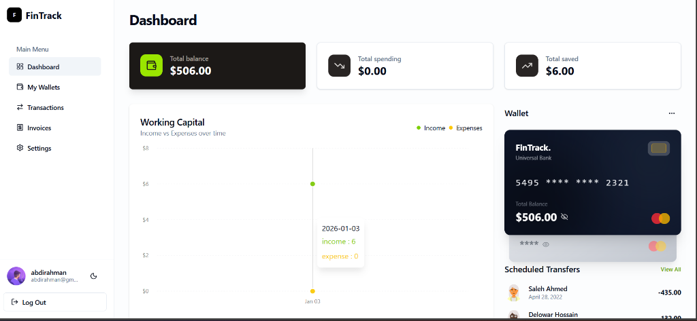

# FinTrack - Personal Finance Management 💰

A modern, full-stack personal finance management application built with the MERN stack (MongoDB, Express.js, React, Node.js).



## ✨ Features

### 📊 Dashboard
- Real-time financial overview with total balance, spending, and savings
- Interactive charts showing income vs expenses over time
- Recent transactions at a glance
- Credit card wallet visualization

### 💳 Wallet Management
- Create multiple wallets (Bank, Cash, Mobile Money)
- Track balances across all accounts
- PIN-protected balance viewing

### 💸 Transaction Tracking
- Record income and expenses
- Categorize transactions
- Search and filter by type
- Automatic wallet balance updates

### 📄 Invoice Management
- Create professional invoices
- Auto-generated invoice IDs
- Mark invoices as paid
- Automatic transaction creation on payment

### 👤 User Profile
- Upload custom profile picture (Cloudinary integration)
- Update name and email
- Secure password changes with 3-day cooldown
- Dark/Light theme toggle

### 🔐 Security Features
- JWT authentication (7-day token validity)
- Password hashing with bcrypt
- Protected API routes
- Logout confirmation dialog

## 🛠️ Tech Stack

### Frontend
- **React 18** with Vite
- **Tailwind CSS** for styling
- **Shadcn/UI** component library
- **Recharts** for data visualization
- **TanStack Query** for server state management
- **Zustand** for client state (Auth)
- **React Router** for navigation
- **Sonner** for toast notifications

### Backend
- **Node.js** with Express.js
- **MongoDB** with Mongoose ODM
- **JWT** for authentication
- **Multer** + **Cloudinary** for image uploads
- **Bcrypt** for password hashing
- **Zod** for validation

## 🚀 Getting Started

### Prerequisites
- Node.js 18+
- MongoDB (local or Atlas)
- Cloudinary account (for profile pictures)

### Installation

1. **Clone the repository**
```bash
git clone https://github.com/A-M-Ahmed/fintrack-finance.git
cd fintrack-finance
```

2. **Install dependencies**
```bash
npm install
```

3. **Configure environment variables**

Create `.env` in the root directory:
```env
PORT=5000
MONGO_URI=mongodb://localhost:27017/fintrack
JWT_SECRET=your_super_secret_jwt_key
JWT_EXPIRES_IN=7d
CLIENT_URL=http://localhost:5173

# Cloudinary Configuration
CLOUDINARY_CLOUD_NAME=your_cloud_name
CLOUDINARY_API_KEY=your_api_key
CLOUDINARY_API_SECRET=your_api_secret
```

4. **Start development servers**
```bash
npm run dev
```

This starts both the client (port 5173) and server (port 5000) concurrently.

## 📁 Project Structure

```
FinTrack/
├── client/                 # React frontend
│   ├── src/
│   │   ├── components/     # Reusable UI components
│   │   ├── layouts/        # Page layouts
│   │   ├── lib/            # Utilities & axios config
│   │   ├── pages/          # Page components
│   │   └── store/          # Zustand stores
│   └── ...
├── server/                 # Express backend
│   ├── src/
│   │   ├── controllers/    # Route handlers
│   │   ├── middleware/     # Auth & upload middleware
│   │   ├── models/         # Mongoose schemas
│   │   ├── routes/         # API routes
│   │   └── utils/          # Helper functions
│   └── server.js
└── package.json            # Root package with scripts
```

## 🔗 API Documentation

The application provides a comprehensive, secure RESTful API for managing personal finances.

### Key Modules
- **Authentication**: JWT-based auth with secure cookie handling and profile management.
- **Wallets**: Multi-currency wallet management with real-time balance tracking.
- **Transactions**: Advanced transaction recording with search, filtering, and categorization.
- **Invoices**: Invoice generation system with status tracking and automatic payment integration.
- **Dashboard**: Aggregated statistical data for financial visualization.

*(All data routes are protected and require a valid Bearer token)*

## 🎨 UI Features

- **Skeleton Loaders** - Smooth loading states with 1s minimum display
- **Responsive Design** - Works on desktop and mobile
- **Dark Mode** - Toggle between light and dark themes
- **Toast Notifications** - Feedback for all actions
- **Form Validation** - Real-time input validation

## 📝 License

This project is open source and available under the [MIT License](LICENSE).

## 👨‍💻 Author

**Abdirahman Ahmed**
- GitHub: [@A-M-Ahmed](https://github.com/A-M-Ahmed)

---

⭐ Star this repository if you found it helpful!
